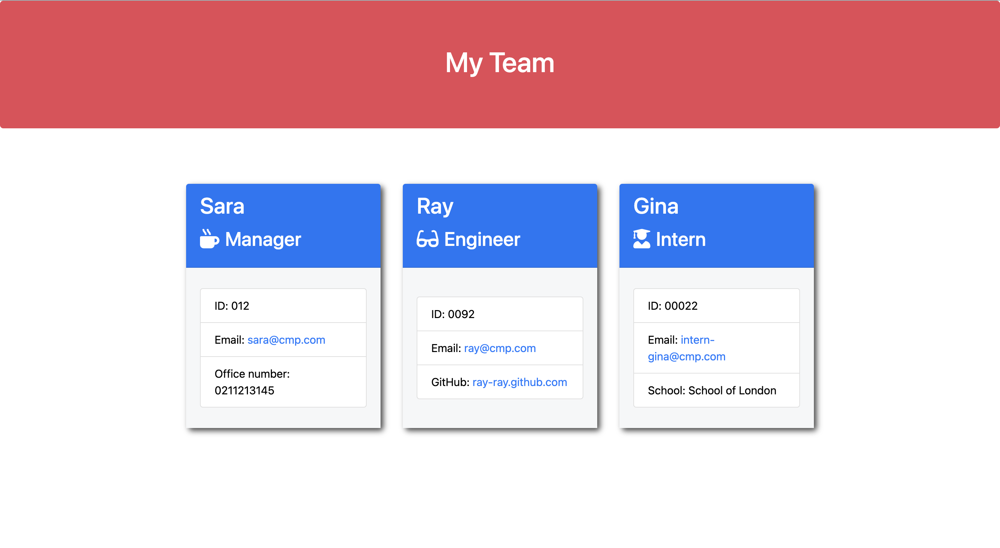

<!-- @format -->

# <span style='color:Pink;border:2px solid Pink; padding:4px; background-color:rgb(100 149 237);'>**ℹ️ know-your-team**</span>

[](https://opensource.org/licenses/MIT)

---

## <span style='color:green'>Description</span>

The <span style='color:Pink'>**ℹ️ know-your-team**</span> application takes in information about employees on a software engineering team, then generates an HTML webpage that displays summaries for each person.

### <span style='color:#7ce4766b;margin-left:3px'>User Story</span>

As a manager a user want to generate a webpage that displays my team's basic info so that a user have quick access to their emails and GitHub profiles.

### <span style='color:#7ce4766b; margin-left:3px'>Acceptance Criteria</span>

- Create a command-line application that accepts accepts user input using the provided starter code.
  - Create classes for each team member provided and export them. The tests for these classes (in the `_tests_` directory) must ALL pass.
    - The first class is an `Employee` parent class with the following properties and methods:
      - `name`
      - `id`
      - `email`
      - `getName()`
      - `getId()`
      - `getEmail()`
      - `getRole()`&mdash;returns `'Employee'`
    - The other three classes will extend `Employee`.
    - In addition to `Employee`'s properties and methods, `Manager` will also have the following:
      - `officeNumber`
      - `getRole()`&mdash;overridden to return `'Manager'`
    - In addition to `Employee`'s properties and methods, `Engineer` will also have the following:
      - `github`&mdash;GitHub username
      - `getGithub()`
      - `getRole()`&mdash;overridden to return `'Engineer'`
    - In addition to `Employee`'s properties and methods, `Intern` will also have the following:
      - `school`
      - `getSchool()`
      - `getRole()`&mdash;overridden to return `'Intern'`
    - Finally, although it’s not a requirement, consider adding validation to ensure that user input is in the proper format.
  - Write code in `index.js` that uses inquirer to gather information about the development team members and creates objects for each team member using the correct classes as blueprints.
    - When a user starts the application then they are prompted to enter the **team manager**’s:
      - Name
      - Employee ID
      - Email address
      - Office number
    - When a user enters those requirements then the user is presented with a menu with the option to:
      - Add an engineer
      - Add an intern
      - Finish building the team
    - When a user selects the **engineer** option then a user is prompted to enter the following and then the user is taken back to the menu:
      - Engineer's Name
      - ID
      - Email
      - GitHub username
    - When a user selects the intern option then a user is prompted to enter the following and then the user is taken back to the menu:
      - Intern’s name
      - ID
      - Email
      - School
    - When a user decides to finish building their team then they exit the application, and the HTML is generated.
  - Call the `render` function (provided for you) and pass in an array containing all employee objects;
    - The `render` function will generate and return a block of HTML including templated divs for each employee!
  - Create an HTML file using the HTML returned from the `render` function.
    - Write it to a file named `team.html` in the `output` folder.
    - You can use the provided variable `outputPath` to target this location.

---

## <span style='color:green'>Installation</span>

I have created a command-line application that dynamically generates a new HTML page from a user's input using the [Inquirer package](https://www.npmjs.com/package/inquirer) and the file system module.

The application will be invoked by using the following command:

```bash
node index.js
```

- the application will accept the user's input;
- the HTML file will be dinamically generated using the fs.writeFile module after the user added the details about the employees.

The following image shows a mock-up of the generated HTML’s appearance and functionality:




---

## <span style='color:green'>Usage</span>

- When a user starts the application then they are prompted to enter the **team manager**’s:
  - Name
  - Employee ID
  - Email address
  - Office number
  - When a user enters those requirements then the user is presented with a menu with the option to:
    - Add an engineer
    - Add an intern
    - Finish building the team
  - When a user selects the **engineer** option then a user is prompted to enter the following and then the user is taken back to the menu:
    - Engineer's Name
    - ID
    - Email
    - GitHub username
  - When a user selects the intern option then a user is prompted to enter the following and then the user is taken back to the menu:
    - Intern’s name
    - ID
    - Email
    - School
  - When a user decides to finish building their team then they exit the application, and the HTML is generated.
- Call the `render` function and pass in an array containing all employee objects;
  - The `render` function will generate and return a block of HTML including templated divs for each employee!
- An HTML file is created using the HTML returned from the `render` function.
  - The newly generated `team.html` file is located in the `output` folder.
  - I used the provided `outputPath` to target this location.

---

## <span style='color:green'>Credits</span>

- the _page-template.js_, _render function_, _style.css_ and _outputPath variable_ were provided for me by the Bootcamp's tutors

---

## <span style='color:green'>License</span>

MIT License

---

## <span style='color:green'>Badges</span>

[](https://opensource.org/licenses/MIT)

---

## <span style='color:green'>Features</span>

N/A

---

## <span style='color:green'>Contribution</span>

N/A

---

## <span style='color:green'>Tests</span>

Node tests

---
